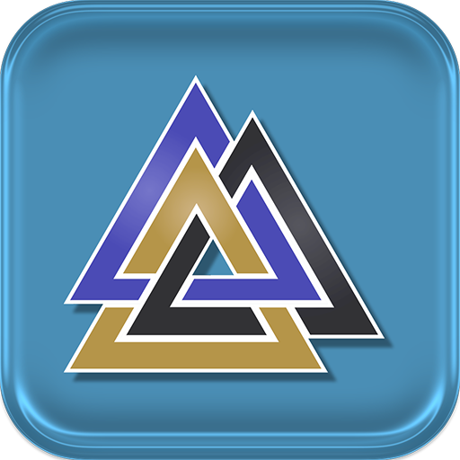

# Valhalla Engine 

An open-source 3D Game Engine 

## Quick Information
### Dependencies
- fmt : For quick logging
- Vulkan (Windows / Linux) : For the graphics API
- Metal (Mac) : For the graphics API
- Qt6 (Editor UI)

### Why Does This Exist?
This engine is a side project I do to prove anyone can build a game engine far better than Unreal Engine 5.

### How can I contribute?
You can submit a pull request or email me.  I'm sure to get back to you eventually

## Compiling
### How do I build for MacOS?
First you need to download the Qt6 SDK for MacOS along with Xcode and run the &rarr; compilemac.sh shell script. 
```
./compilemac.sh
```
If you get a permission error when trying to run the script then do the following 
```
chmod +x compilemac.sh
``` 
